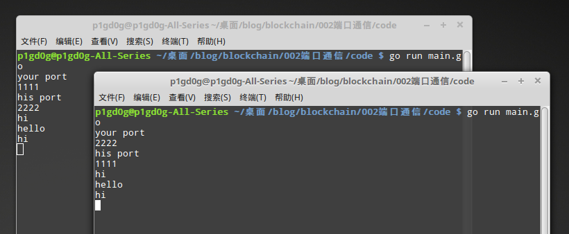

# 端口通信

节点之间要传输数据，一般来说，区块链应用都会有特定的一个端口号用来通信。

端口通信适合各种情况，无论是本地节点，还是联网节点。

这里举一个简单的例子。

```go
package main

import (
	"fmt"
	"net"
)

func main() {

	var myPort string
	var hisPort string

	fmt.Println("your port")
	fmt.Scan(&myPort)

	fmt.Println("his port")
	fmt.Scan(&hisPort)

    l, _ := net.Listen("tcp", ":"+myPort)
    // 监听自己的端口号。
	go func() {
		for {
			conn, _ := l.Accept()
			handle(conn)
		}
	}()

	for {
		message := make([]byte, 111)
		fmt.Scan(&message)
		conn, _ := net.Dial("tcp", ":"+hisPort)
        conn.Write(message)
        // 向对方的端口发送数据。
	}

}

func handle(conn net.Conn) {
	message := make([]byte, 111)
	lengh, _ := conn.Read(message)

	fmt.Println(string(message[:lengh]))
}
```

同时打开两个程序，分别输入自己和对方的端口号（自定义，但是不要太小，会冲突）。



接着输入随便什么文本，可以在对方的程序内看到。